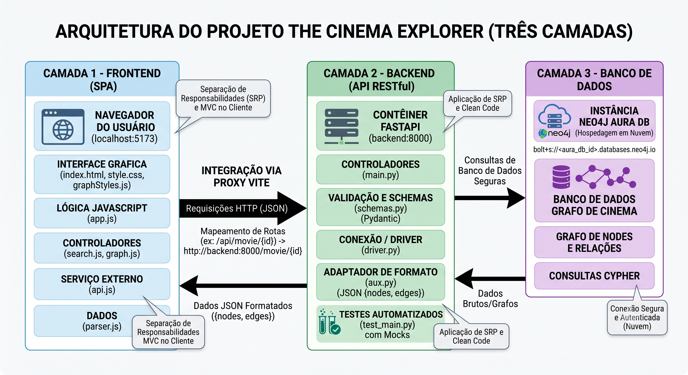

# The Cinema Explorer

O **The Cinema Explorer** é uma aplicação web interativa desenvolvida como projeto final para a disciplina de Introdução ao Desenvolvimento de Software. A proposta do projeto é transformar a exploração do universo cinematográfico em uma experiência visual e investigativa, permitindo que o usuário descubra conexões entre filmes, atores, diretores e obras por meio de um grafo interativo.

Em vez de navegar apenas por listas estáticas de filmes ou elencos, a aplicação oferece um “mapa” visual da indústria cinematográfica. A partir de um filme ou de uma pessoa central, o usuário pode expandir a rede, seguir novos caminhos de relacionamento e descobrir novas obras, criando uma experiência de exploração mais dinâmica e intuitiva.

## Introdução do Projeto

Este projeto foi pensado como uma forma de aproximar o usuário de uma visão mais conectada do cinema. A ideia central é mostrar que filmes, atores e diretores fazem parte de uma grande rede de relações, e que essas conexões podem ser exploradas de maneira visual, interativa e agradável.

A aplicação foi construída com foco tanto no uso prático quanto no aprendizado acadêmico, reunindo conceitos de desenvolvimento web, integração de APIs, modelagem de dados em grafos e arquitetura de software em uma solução funcional e de fácil visualização.

## Principais Funcionalidades

* **Exploração visual por grafos:** A interface permite visualizar filmes, atores e diretores como nós de uma rede interativa.
* **Expansão dinâmica de conexões:** Ao clicar em uma pessoa do grafo, o usuário pode expandir o conjunto de filmes relacionados a ela e seguir novos caminhos de descoberta.
* **Mudança de contexto no grafo:** Um filme ou uma pessoa revelada na rede pode se tornar o novo centro da exploração, permitindo navegação contínua entre diferentes conexões.
* **Painel de detalhes:** Ao selecionar um nó, o sistema exibe informações mais completas sobre o filme, ator ou diretor, como sinopse, dados básicos e biografia quando disponíveis.
* **Busca rápida:** O usuário pode localizar rapidamente títulos e nomes para iniciar a exploração a partir de um ponto específico.
* **Navegação por categorias e populares:** A aplicação também oferece acesso a uma visão geral de filmes populares e por gêneros, complementando a experiência do grafo.


Acesse o [Figma](https://www.figma.com/site/qH8L9fTHLKZUHzouOaPkZR/Untitled?node-id=0-1&p=f) para checar a proposta visual da interface.

## Principais Ferramentas e Tecnologias

O projeto utiliza uma combinação de tecnologias modernas para atender às necessidades de frontend, backend e banco de dados em grafo:

* **Neo4j / Neo4j Aura:** banco de dados em grafo utilizado para armazenar e relacionar filmes, atores e diretores.
* **Cytoscape:** biblioteca responsável pela renderização e interação visual do grafo na interface.
* **FastAPI:** backend da aplicação, responsável por expor endpoints para consulta dos dados e integração com a lógica da aplicação.
* **Vite:** ferramenta de build e desenvolvimento do frontend, usada para montar a interface web de forma rápida e organizada.
* **Docker Compose:** ambiente de execução containerizado para facilitar a execução do projeto em diferentes máquinas.
* **The Movie Database (TMDB):** fonte de dados utilizada para obter informações sobre filmes, atores, diretores e imagens.

## Arquitetura do Sistema

A aplicação segue uma arquitetura de 3 camadas, que separa responsabilidades e facilita tanto a manutenção quanto a evolução do projeto.

### 1. Camada de apresentação

Essa camada é responsável pela interface do usuário. Nela estão os componentes da aplicação web, a navegação, a busca, o grafo interativo e os painéis de detalhes. No projeto, essa camada é construída com o frontend em Vite e JavaScript, com renderização visual baseada em Cytoscape.

### 2. Camada de aplicação

Essa camada concentra a lógica da aplicação. O backend, implementado com FastAPI, recebe as requisições do frontend, prepara os dados e organiza o fluxo de comunicação entre a interface e o banco de dados. É nela que a aplicação transforma as informações brutas em respostas estruturadas para a experiência do usuário.

### 3. Camada de dados

Essa camada é responsável pelo armazenamento e recuperação dos dados em grafo. O projeto utiliza Neo4j, com o serviço Neo4j Aura para hospedar os dados, permitindo representar relações entre filmes, atores e diretores de maneira natural e eficiente.

A imagem abaixo apresenta o esquema geral da arquitetura do projeto:



## Execução do Projeto

Para construir as imagens e iniciar os contêineres em segundo plano, execute na raiz do repositório:

```bash
docker compose up -d --build
```

Acesse a aplicação no navegador: [http://localhost:5173/](http://localhost:5173/)

Para interromper a execução e remover os contêineres (mantendo os volumes de dados intactos):

```bash
docker compose down
```

> **Atenção:** Se desejar limpar completamente o ambiente e destruir os volumes de dados persistidos, adicione a flag de volume: `docker compose down -v`.

## Melhorias Futuras

O projeto já possui uma base funcional e interessante, mas ainda há espaço para evoluir. Entre as melhorias planejadas para versões futuras, destacamos:

* **Login e favoritos:** permitir que o usuário crie uma conta e salve filmes ou pessoas de interesse.
* **Estética visual mais única:** aprofundar a identidade visual do site, seguindo uma proposta ainda mais forte de estética espacial, em que o usuário seria percebido como um explorador do universo do cinema.
* **Ampliar a cobertura de filmes:** incluir obras nacionais e produções de outras regiões do planeta, tornando a experiência mais global e diversa.
* **Padronização de linguagem:** unificar a interface e as descrições em um único idioma, reduzindo inconsistências causadas por informações vindas de fontes como o TMDB.
* **Melhorias de conteúdo e usabilidade:** enriquecer os dados exibidos, melhorar a acessibilidade e tornar a navegação ainda mais intuitiva.

---

*Projeto em desenvolvimento.*


